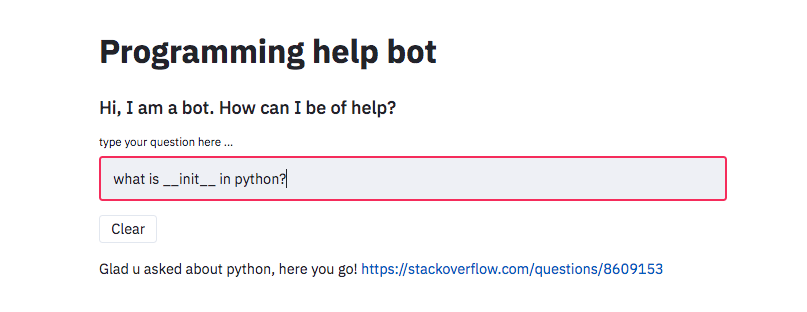
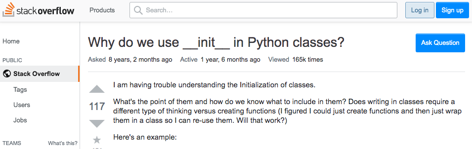
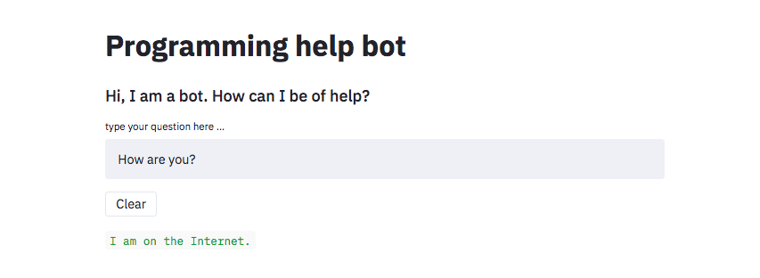

# Stack Overflow helpbot
It is a natural language understanding bot to help user to find the best possible Stack Overflow post that can aid one's query. Besides, it can perform human daily conversation.

### Content
- `intent classification and answer ranking.ipynb` - show the modelling process, in particular how intent classifier and answer ranking were constructed.
  
- `dialogue_manager.py` - controls the flow of chating.
  
- `model_artifacts` - folder containing trained classification models.
  
- `starspace_embeddings` - folder containing word embeddings trained in starspace which is a open-source library by facebook to facilitate the training of any forms of embeddings. For more details, visit  [StarSpace](https://github.com/facebookresearch/StarSpace).
  
- `db.sqlite3` - database for chatbot which has been trained with the English corpus provided by ChatterBot.

### Demo  
- Enter your query and chatbot will find its answer  
  
  

- The answer link preview  
  
  

- It can perform daily chating as well 
  
  

### Running locally
```bash
# install dependencies
pip install -r requirements.txt

# download data
python download_data.py

# setup starspace and data-preprocessing (optional)
cd starspace_embeddings
python words_preprocessing.py

# run in localhost: 8501
streamlit run deployment.py
```


